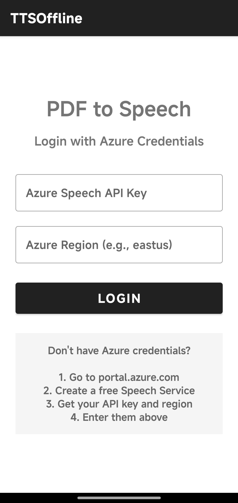
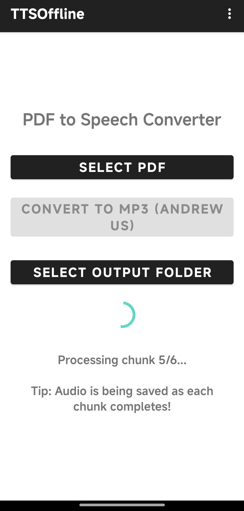
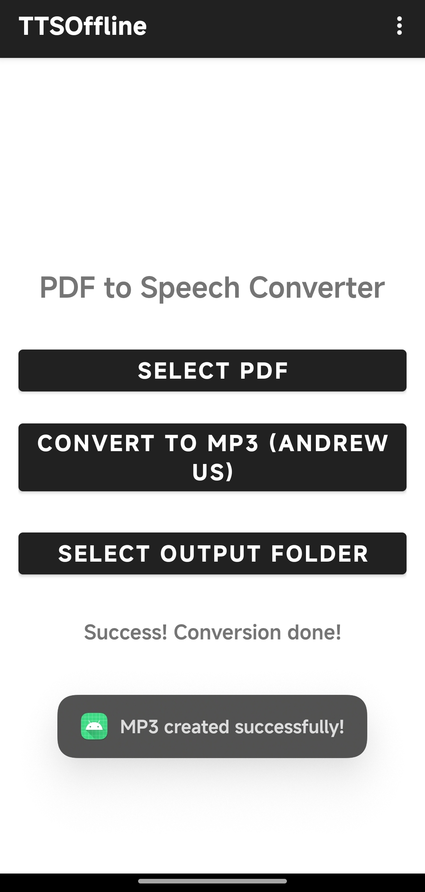

# PDF to Speech - Android

Simple Android app to convert PDF documents to MP3 audio files using Microsoft Azure's Text-to-Speech with Andrew's voice.
(Andrew's voice because I think it's the most New York podcast-coded voice, easier to listen to, you can just change it in the code yourself before building)

## Screenshots

## Features

- Convert any PDF to MP3 audio
- High-quality Andrew voice (en-US-AndrewNeural)
- Choose where to save your files
- Handles large PDFs by splitting into chunks
- See progress as it converts

## Setup

### 1. Get Azure Credentials

You need a free Microsoft Azure account:

1. Go to [portal.azure.com](https://portal.azure.com)
2. Create a Speech Service (free tier available)
3. Get your API key and region from "Keys and Endpoint"

### 2. Install & Login

1. Download the APK from [Releases](../../releases)
2. Install on your Android device
3. Open the app and enter your Azure API key and region
4. That's it - you're ready to convert!

## How to Use

1. Tap "Select PDF" and choose your file
2. Tap "Select Output Folder" and pick where to save
3. Tap "Convert to MP3"
4. Wait for it to finish (you can listen as it saves each chunk)

## Requirements

- Android 8.0+
- Internet connection
- Azure Speech Service account (free tier: 500k characters/month)

## Known Issues

- App targets Android API 33 due to Azure SDK compatibility
- Large PDFs take a while to convert

## Tech Stack

- Kotlin
- Azure Speech SDK
- PDFBox Android
- Material Design

## License

MIT License - feel free to use and modify.

---

Made for converting PDFs to audiobooks easily.
